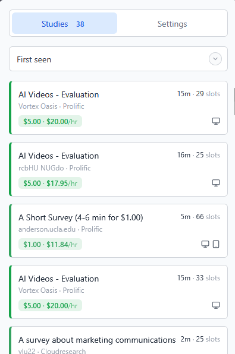

# Study Signal


A browser extension that monitors research study platforms and alerts you when new studies are available.

<table>
  <tr>
    <td></td>
    <td></td>
  </tr>
</table>


## Features

- **Live Studies Inbox:** View cached studies from supported sites in one popup tab, with sorting by reward and hourly rate.
- **Highlight Rates:** Applies color scaling to hourly rates to highlight higher and lower paying studies.
- **Currency Conversion:** Converts rewards into your selected target currency.
- **Direct Study Links:** Open study detail pages directly from the popup or supported listings pages.
- **Notifications:** Browser alerts with optional sound, provider delivery, and researcher include/exclude filters.
- **Auto Reload:** Automatically refreshes the page at random intervals to check for new studies.
- **Analytics:** Tracks completed studies and daily progress per supported site.
- **Mixed Scope Settings:** Configure site-specific study behavior alongside global delivery and display preferences.

## Supported Sites

- [Prolific](https://app.prolific.com/studies)
- [CloudResearch](https://connect.cloudresearch.com/participant/dashboard)

## Installation

### Chrome / Chromium

1. Download the latest release `.zip` for Chrome.
2. Unzip the file.
3. Go to `chrome://extensions` and enable **Developer mode**.
4. Click **Load unpacked** and select the unzipped folder.

### Firefox

1. Download the latest release `.zip` for Firefox.
2. Unzip the file.
3. Go to `about:debugging#/runtime/this-firefox`.
4. Click **Load Temporary Add-on** and select any file in the unzipped folder.

## Usage

1. Navigate to a supported site.
2. Click the Study Signal icon in the toolbar to open the popup.
3. Use the `Studies` tab to view live study snapshots combined from supported open tabs.
4. Use the `Settings` tab to configure the currently selected site.
5. Keep a supported study listings tab open if you want live studies and alerts to keep updating.

## Provider Setup

The extension supports Telegram notifications when your device is idle/locked and the provider is enabled.
Browser notifications are available directly in the extension, and sound alerts are supported in Chromium-based browsers.

### Telegram setup

1. Open Telegram and start a chat with [@BotFather](https://t.me/BotFather).
2. Create a bot using `/newbot` and copy the bot token.
3. Send at least one message to your bot from your Telegram account.
4. Paste the token into **Providers -> Telegram -> Bot token**.

### Troubleshooting

- Ensure the extension has been reloaded after permission changes.
- Confirm your token is correct.
- For Telegram, make sure you sent a message to the bot before testing.

Provider credentials are stored in extension storage on your local browser profile.

## Development

### Prerequisites

- [Bun](https://bun.sh/) v1.2+

### Setup

```bash
git clone https://github.com/theChantu/study-signal.git
cd study-signal
bun install
```

### Commands

```bash
bun run dev              # Dev mode (Chrome)
bun run dev:firefox      # Dev mode (Firefox)
bun run build            # Production build (Chrome)
bun run build:firefox    # Production build (Firefox)
bun run zip              # Package for distribution (Chrome)
bun run zip:firefox      # Package for distribution (Firefox)
```

## Contributing

Contributions are welcome! Feel free to open an issue or submit a pull request.

1. Fork the repository
2. Create a feature branch
3. Make your changes
4. Open a pull request against `main`

## Privacy

See [PRIVACY.md](PRIVACY.md) for details on how the extension handles your data.

## License

Distributed under the MIT License. See `LICENSE` for more information.
